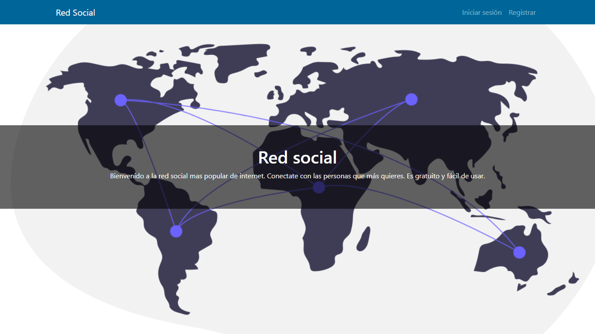
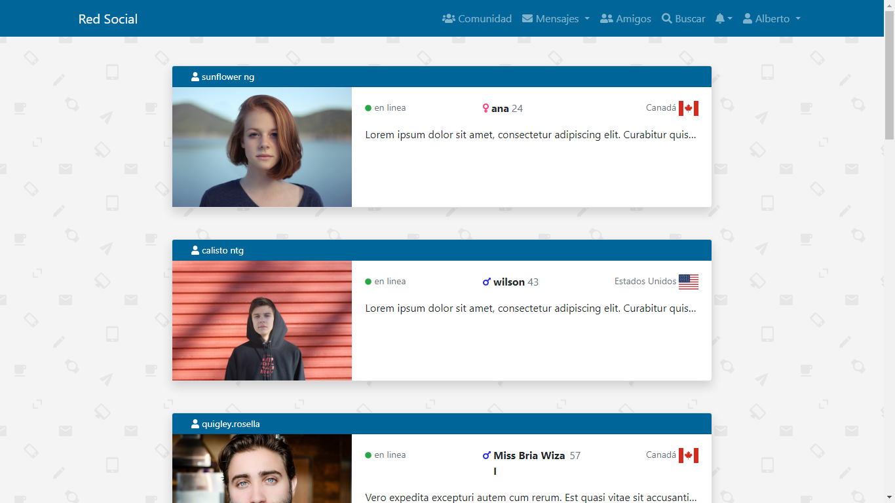
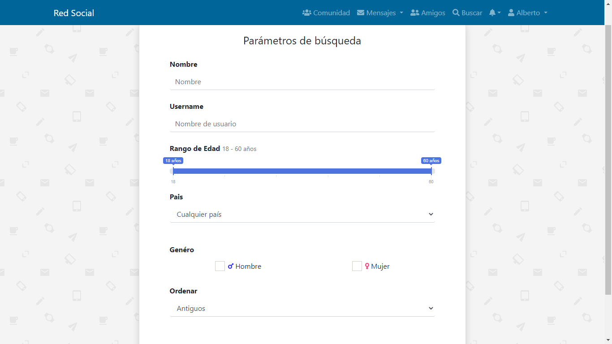

# Overview - Social Network
Welcome to social network developed with **Laravel** and **Vue**. This project uses **Fortify** package for authentication, Vue components for notifications and friend requests, **axios** for communication between components Vue, database and Laravel. Also, take advantage of architecture **API RESTful**. Also, This project includes *Eloquent*, an object-relational mapper (ORM) powerful by Laravel

The main things to do: login, register, edit your profile, upload a new profile photo, send friend requests, send messages, chat, friends list, search profiles and manage your account.   

# Requirements
* PHP 8.0
* Microsoft SQL Server 2019 Express
* Lastest version
    * Composer
    * Node.js
    * npm

Note: 
* if you use another SMDB you may look the official documentation for laravel and setup new params to *.env* file. [Read more](https://laravel.com/docs/9.x/database "go documentation")

* if you want to config SQL Server for this project you may follow next steps in this resource [Read more](https://learn.microsoft.com/es-es/sql/connect/php/microsoft-php-driver-for-sql-server?view=sql-server-ver16 "go resource") 

* if you want to config authentication by login for SQL Server you may follow next resource. [Read more](https://learn.microsoft.com/en-us/sql/relational-databases/security/authentication-access/create-a-login?view=sql-server-ver16 "go resource")

# Get start

### **Download or clone this repository**
```bash
git clone https://github.com/olmos-dev/social-network.git
```

### **Install**
Install vendor folder
```bash
composer update
```

Install node modules
```bash
npm install
```
### **Config database**
1. Create a new database for this project

2. Create  a new **.env** file

3. Now setup params and your database connection in **.env** file 
    ```bash
    DB_CONNECTION=sqlsrv
    DB_HOST=127.0.0.1
    DB_PORT=1433
    DB_DATABASE=laravel
    DB_USERNAME=developer
    DB_PASSWORD=12345678
    ```
4. You may migrate database tables
    ```bash
    php artisan migrate
    ```
5. You may run seeders
    ```bash
    php artisan db:seed
    ```
### **Key generate**
you should assign a new key generate for this app
```bash
php artisan key:generate
```

# Run project
run laravel server
```bash
php artisan serve
```
run npm server
```bash
npm run dev
```
Now open your browser and enjoy this web aplicaction!
```bash
http://127.0.0.1:8000/red-social
```

Note: there are three profiles availables to login, or well you may register and create a new account.

|User|Password|
|:----|-------:|
|alberto@mail.com|12345678
|ana@mail.com|12345678
|wilson@mail.com|12345678


# Live preview
click here [Social Network](https://agendacontactos2.000webhostapp.com/ "go live demo")


# Build with
* Laravel 9.1
* Vue 3
* PHP 8.0
* Bootstrap 4.6
* SQL Server Express Edition 
* Javascript

# Documentation

### Database Model


### Relationships

* *Users* model has one to one relationship with *Perfil* model

* *Perfil* model has one to one relationship with *idioma*, *genero* and *pais* models

* *Mensaje* model has one to many relationship with *Perfil* and *Users* models

* *Amigo* model has one to many relationship with *Perfil* and *Users* models

* *Notifications* default model by Laravel

* *Buscar* model only used for filling field to search params by sort


### Usage
Home page


Login 


Register


Community


Messages


Friends


Search


Notifications


Account 


My profile


Edit profile


Edit profile photo


Show profile


Chat


# Author
Alberto Olmos 

# Licence
This project is MIT licensed.

